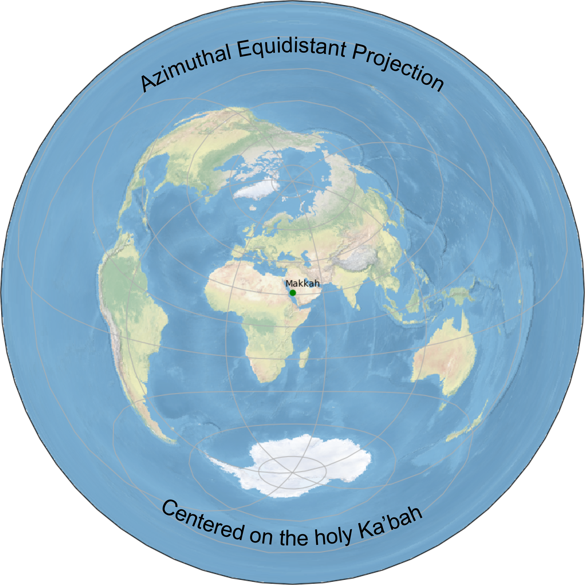

# Introduction

Azimuthal equidistant projection created with the holy Kabbah, created using cartopy.

Cartopy is a Python package designed for geospatial data processing in order to produce maps and
other geospatial data analyses.
Cartopy makes use of the powerful PROJ.4, NumPy and Shapely libraries and includes a programmatic
interface built on top of Matplotlib for the creation of publication quality maps.

## Development

You need to install [Install Cartopy Dependencies](https://scitools.org.uk/cartopy/docs/latest/installing.html#required-dependencies) before this tool can be used.

After that install all python dependencies

```bash
pipenv install
```

## Projection Around Kabbah


